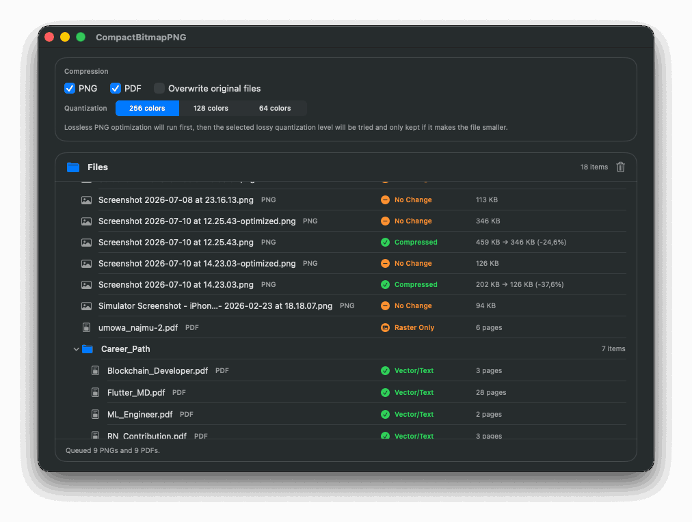

# CompactBitmapPNG

A small macOS SwiftUI app for two independent file-processing workflows: drop in PNGs and/or PDFs, and it optimizes what it can.



## Why

There used to be a TinyPNG desktop app, but it stopped working on Apple Silicon Macs. That's the PNG side.

The PDF side: exporting a resource as a PDF from a design tool doesn't mean it's actually vector. A PDF can just as easily contain an embedded bitmap. That's why this app first checks whether a PDF is vector/text, raster, mixed, or empty, and then, for PDFs that turn out to be raster, compresses the embedded bitmap in place — the same way it would a standalone PNG.

## Features

- **PNG optimization** — lossless re-encode that only replaces a file if the result is smaller. Optionally tries lossy adaptive color quantization (256/128/64 colors) on top and keeps whichever candidate is smallest.
- **PDF vector/raster check** — scans each page's content stream to classify it as vector/text, raster, mixed, or empty. Text counts as "vector" content since it's stored as drawing instructions, not a raster image.
- **PDF bitmap compression** — for PDFs that are just a single full-page image per page (e.g. scanned documents), recompresses the embedded bitmap and rebuilds the PDF, again only keeping the result if it's smaller.
- **Click a result row to open it** — opens the optimized/compressed file (or the original, if nothing changed) in the default app.
- **Settings persist** — the compression toggles, quantization level, and overwrite-original preference are remembered across launches.
- Localized in English, Russian, and Belarusian, following the system's preferred language.

## Requirements

- macOS 14+
- Xcode (Swift 6 toolchain)
- [XcodeGen](https://github.com/yonaskolb/XcodeGen) — `brew install xcodegen`
- [SwiftLint](https://github.com/realm/SwiftLint) (optional but recommended) — `brew install swiftlint`

## Getting started

This is an Xcode-only app target — there's no SwiftPM executable, only `project.yml` (the [XcodeGen](https://github.com/yonaskolb/XcodeGen) source of truth) and the `.xcodeproj` it generates.

```bash
xcodegen generate
open CompactBitmapPNG.xcodeproj
```

Or build/test from the command line:

```bash
xcodebuild -project CompactBitmapPNG.xcodeproj -scheme CompactBitmapPNG -configuration Debug build
xcodebuild -project CompactBitmapPNG.xcodeproj -scheme CompactBitmapPNG -configuration Debug test
```

Run a single test (the project uses [Swift Testing](https://developer.apple.com/documentation/testing), not XCTest, for unit/reducer tests):

```bash
xcodebuild -project CompactBitmapPNG.xcodeproj -scheme CompactBitmapPNG -configuration Debug test -only-testing:CompactBitmapPNGTests/<TestName-or-SuiteName>
```

Whenever `project.yml` changes, regenerate the project before opening it: `xcodegen generate`.

## Architecture

Built with [The Composable Architecture](https://github.com/pointfreeco/swift-composable-architecture) on Swift 6 strict concurrency — a single reducer (`Features/AppFeature/AppFeature.swift`) owns all app state, with pure, TCA-independent `Services/` types (`PNGOptimizer`, `PDFVectorAnalyzer`, `PDFBitmapCompressor`) doing the actual file processing. See `CLAUDE.md` / `AGENTS.md` for a fuller breakdown of the module layout and conventions.

## Notes

- By default, optimized/compressed files overwrite the original; disabling "Overwrite original files" writes them alongside the original using an `-optimized.png` / equivalent suffix instead.
- PNG/PDF processing is intentionally conservative: it only ever writes an output if that output is smaller than the input.

## License

[MIT](LICENSE)
